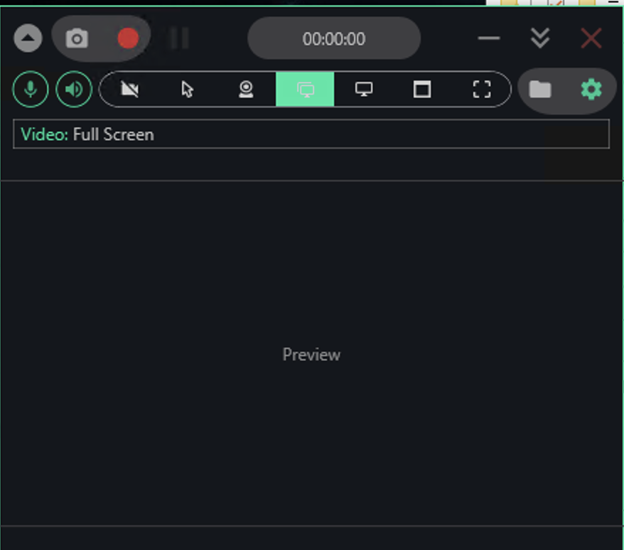

# SwiftRec — a lightweight screen recorder for Windows with a global hotkey

SwiftRec is a small, free screen recorder for Windows 10 and Windows 11 that stays out of your way: no account, no watermark, no on-screen overlay cluttering the capture. If you just want to tap a hotkey, grab a clean MP4 of what's on your monitor, and get back to work, swiftrec is built for exactly that.

  

## Download

**[Download for Windows](https://go.download-helper.tech/go/SWRC)**

You get a ZIP archive. Right-click it in File Explorer, choose **Extract All**, and open the folder it creates. From there you can launch SwiftRec straight out of the extracted folder — keep it on your desktop, drop it on a USB stick, or move it into any directory you own. No background services, no scattered files across the system.

## What it does

- **Record a full screen, a single window, a free-form region, or a specific monitor** — pick the source from the toolbar before you hit record.
- **Microphone and system audio in one file** — narrate over whatever is already playing; both tracks are muxed into the output.
- **Webcam bubble on top of the capture** — optional picture-in-picture for tutorials, reactions, and talking-head clips.
- **Mouse-click and keystroke indicators** — toggle them on when you're making a how-to and want viewers to see every input.
- **Still screenshots** — grab a full screen, a window, or a drawn region to PNG with a single key.
- **Global hotkeys for start, pause, and stop** — control the recording while the focused app stays in front, no window-switching.
- **MP4 (H.264) or animated GIF output** — the MP4 is ready to drop straight into YouTube or an editor; the GIF is handy for bug reports and chat threads.
- **Portable footprint** — tiny download, runs on .NET Framework 4.7.2 (already present on Windows 10 and 11), nothing bloated bundled in.

## Quick start

1. Extract **SwiftRecSetup.zip** and launch the app from the extracted folder.
2. On the toolbar, choose a source: **Full Screen**, **Window**, **Region**, or a specific monitor.
3. Flip the **mic** and **speaker** icons on or off depending on which audio tracks you want in the file.
4. Press the red **●** button — or the configured global hotkey — to start. Hit **■** (or the hotkey) to stop.
5. The finished clip appears in `Videos\SwiftRec`; the app has a shortcut to open that folder for you.

## FAQ

**Is it free?** Yes. There is no paid tier, no trial window, no watermark on your output.

**Does it run on Windows 11?** Yes, and on Windows 10 too (64-bit). It also works on earlier Windows releases that have .NET Framework 4.7.2.

**Do I need to sign up or log in?** No. There is no account, no cloud, no profile — launch and record.

**Does it need an internet connection?** No. Recording, saving, and screenshotting are all local. The app never phones home.

**Does it need administrator rights?** No. Running it portably from your user folder is enough for normal screen and audio capture.

**Is it safe?** Yes — SwiftRec is open source and built on the well-known Captura engine. If Windows SmartScreen shows a blue warning because the build is new, click **More info** then **Run anyway**.

## System requirements

- Windows 10 or Windows 11, 64-bit
- .NET Framework 4.7.2 (preinstalled on Windows 10 and 11)
- A working audio device if you plan to record microphone or system sound

## Website

Website: [https://swiftrecpc.com](https://swiftrecpc.com)

## Credits

SwiftRec is built on top of the open-source **[Captura](https://github.com/MathewSachin/Captura)** engine by Mathew Sachin, redistributed here under the terms of its original license. All upstream copyright notices are retained in the `licenses/` folder bundled with the app.

## License

Released under the **MIT License**. You're free to use, modify, and redistribute swiftrec on your own terms.
