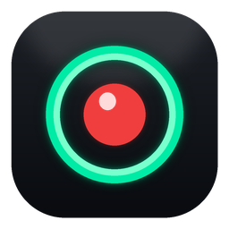
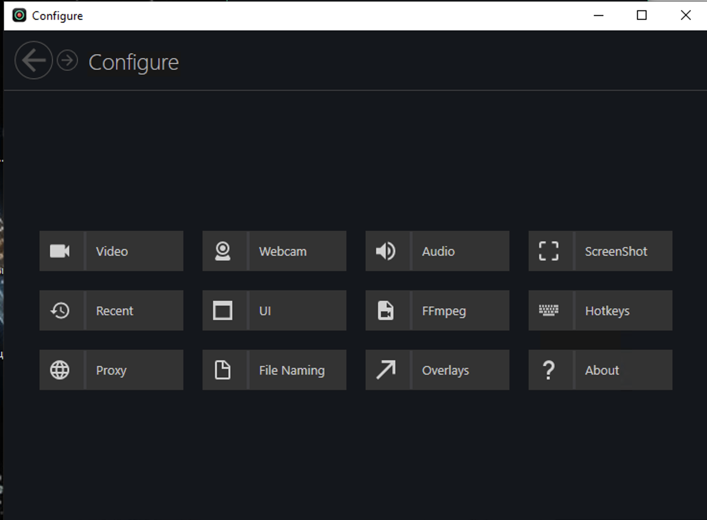

<p align="center">
  
</p>

<h1 align="center">SwiftRec</h1>

<p align="center">
  <b>A fast, free and open-source screen recorder for Windows.</b><br>
  Capture your screen, webcam and audio in one click — no watermark, no sign-up, no limits.
</p>

<p align="center">
  <a href="https://github.com/Fi6uDvGWucFv/SwiftRec/releases/latest"></a>
  
  
  <a href="https://t.me/windows_free_software"></a>
</p>

<p align="center">
  
</p>

## Features

- 🎬 **Record anything** — full screen, a single window, a custom region, or a specific monitor
- 🎤 **Voice + system audio together** — narrate with your microphone while capturing what plays on screen, muxed into one file
- 📷 **Webcam overlay** — add a webcam bubble on top of your recording for tutorials and reactions
- 🖱️ **Show clicks & keystrokes** — optional mouse-click and keystroke overlays, great for how-to videos
- 🖼️ **Screenshots** — grab full screen, window or region to PNG in a keypress
- ⌨️ **Global hotkeys** — start, pause and stop without switching windows
- 📦 **MP4 / GIF output** — clean H.264 MP4 or animated GIF, no watermark
- 🪶 **Light & portable** — tiny installer, runs on .NET Framework, no bloat

## Download

**➡️ [Download the latest release](https://github.com/Fi6uDvGWucFv/SwiftRec/releases/latest)**

Two ways to run it:

| | |
|---|---|
| **Installer** | `SwiftRecSetup.zip` — download, unzip and run `SwiftRecSetup.msi` to install. Adds Start-menu and optional desktop shortcut. |
| **Runtime**   | Requires .NET Framework 4.7.2 (preinstalled on Windows 8.1 / 10 / 11) |

Website: [swiftrecpc.com](https://swiftrecpc.com)

Telegram: [@windows_free_software](https://t.me/windows_free_software) — free & clean Windows software, new releases posted here.

## Quick start

1. Launch **SwiftRec**.
2. Pick a source on the toolbar — **Full Screen**, **Window**, **Region** or **Screen**.
3. Toggle the **microphone** 🎤 and **speaker** 🔊 icons for the audio you want.
4. Hit the red **●** button (or the hotkey) to start, and **■** to stop.
5. Your clip lands in `Videos\SwiftRec` — open the folder straight from the app.

## Screenshots

<p align="center">
  
</p>

## Build from source

SwiftRec targets **.NET Framework 4.7.2** and builds with Visual Studio 2022 (or Build Tools) + MSBuild.

```bash
git clone https://github.com/Fi6uDvGWucFv/SwiftRec.git
cd SwiftRec
msbuild src/Captura.sln /t:Restore /p:Configuration=Release
msbuild src/Captura.sln /t:Build   /p:Configuration=Release
```

The build output appears in `src/Captura/bin/Release/SwiftRec.exe`.

## Credits

SwiftRec is built on top of the excellent open-source **[Captura](https://github.com/MathewSachin/Captura)** engine by **Mathew Sachin**, used and redistributed under the MIT License. All original copyright is retained — see [LICENSE.md](LICENSE.md) and the bundled third-party notices in [`licenses/`](licenses/).

## License

Released under the **[MIT License](LICENSE.md)**. You are free to use, modify and distribute it.
